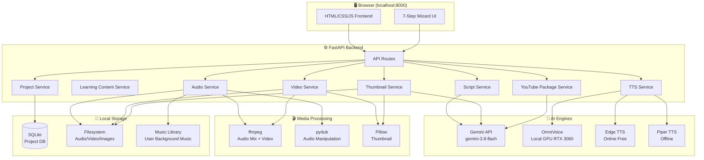
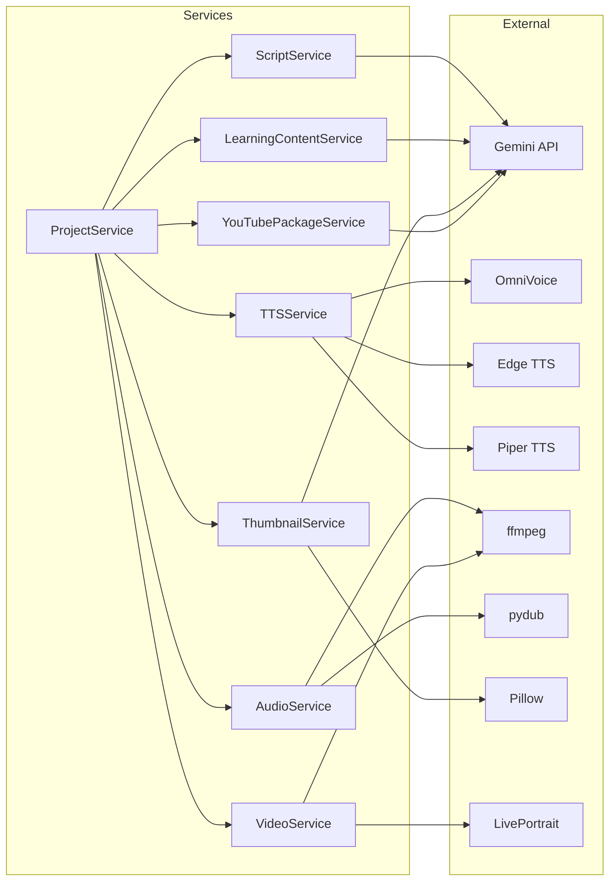

# ARCHITECTURE.md — Daily Intel English Studio

<!-- crystallize_version: 0.8.0 -->

## System Overview

Daily Intel English Studio là một **local web application** chạy trên `http://localhost:8000`. Backend Python FastAPI xử lý toàn bộ logic AI, TTS, audio/video processing. Frontend HTML/CSS/JS thuần túy giao tiếp với backend qua REST API.

```
Browser (localhost:8000)
        ↕ REST API / WebSocket (streaming)
FastAPI Backend (Python 3.11+)
        ├── Gemini API (script + learning content + thumbnail fill)
        ├── OmniVoice (local GPU TTS — RTX 3060 12GB)
        ├── Edge TTS (backup TTS — free, online)
        ├── Piper TTS (offline fallback TTS)
        ├── pydub + ffmpeg (audio mix + video export)
        ├── Pillow (thumbnail generation)
        └── SQLite (project storage)
```

## ViePilot Organization Context

profile_id: none / not configured

---

## Diagram Applicability Matrix

| Diagram Type | Status | Rationale | Diagram source |
|---|---|---|---|
| system-overview | required | Kiến trúc local web app multi-module | .viepilot/architecture/system-overview.mermaid |
| data-flow | required | Pipeline 7 bước Script→Audio→Video | .viepilot/architecture/data-flow.mermaid |
| event-flows | optional | WebSocket streaming TTS | — |
| module-dependencies | required | Services graph | .viepilot/architecture/module-dependencies.mermaid |
| deployment | N/A | Local only, no cloud deployment | — |
| user-use-case | optional | Single user, use cases straightforward | — |

---

## System Overview Diagram

> Diagram source: .viepilot/architecture/system-overview.mermaid



---

## Data Flow Diagram (7-Step Pipeline)

> Diagram source: .viepilot/architecture/data-flow.mermaid


---

## Module Dependencies

> Diagram source: .viepilot/architecture/module-dependencies.mermaid



---

## Services Definitions

### 1. ScriptService (`app/services/script_service.py`)
- **Responsibility:** Generate podcast script via Gemini API with strict prompt control
- **Inputs:** topic, CEFR level, duration, num_speakers, genre, accent, language_features
- **Outputs:** Structured script JSON (speaker, line, timing_estimate, language_notes)
- **Key logic:** CEFR-calibrated prompt templates, per-genre prompt, language feature toggles
- **Re-generate:** per-segment regeneration support

### 2. LearningContentService (`app/services/learning_service.py`)
- **Responsibility:** Generate vocabulary, idioms, grammar notes, and comprehension questions via Gemini API with strict structured JSON schema
- **Inputs:** project script lines, CEFR level, topic
- **Outputs:** Structured learning pack JSON (`LearningPackOut`: vocabulary with IPA and bilingual definitions, idioms, grammar points, quiz questions with answer keys)
- **Key logic:** Structured JSON schema validation (`responseSchema`), fallback handling, SQLite persistence with UPSERT
- **Storage:** `learning_contents` table in SQLite

### 3. TTSService (`app/services/tts_service.py`)
- **Responsibility:** Convert script lines → audio files per speaker
- **Engines (priority order):**
  1. OmniVoice (GPU) — primary, voice design via text description
  2. Edge TTS — backup (free, online, many accents)
  3. Piper TTS — offline fallback
  4. Google Cloud TTS — optional API
  5. Azure TTS — optional API
- **Outputs:** Per-line WAV/MP3 files in `data/tts_cache/`
- **Voice mapping:** Each speaker → engine + voice_id + speed/pitch/volume settings

### 4. AudioService (`app/services/audio_service.py`) — Sub-task 1.6b, DONE
- **Responsibility:** Mix per-speaker audio lines → final podcast audio. Only processes
  already-synthesized audio (never calls a TTS engine itself — that split is deliberate).
- **Operations:**
  - Concatenate lines in `line_index` order with silence gaps (`SILENCE_SAME_SPEAKER_MS`
    same-speaker, `SILENCE_DIFFERENT_SPEAKER_MS` different-speaker)
  - Normalize integrated loudness to `TARGET_LOUDNESS_LUFS` via real ITU-R BS.1770
    measurement (`pyloudnorm`), gain-clamped so near-silent input can't be over-boosted
  - Add background music from `data/music_library/` (optional, filename passed per
    generate-call — no project-level "selected track" column yet): looped/trimmed to the
    mix's duration and capped at a **flat** `MUSIC_DUCKING_MAX_DBFS` ceiling for its whole
    length — a static-level duck, not dynamic speech-reactive ducking
  - Export MP3 (192kbps) + WAV (44100Hz 16-bit) to `data/audio_output/{project_id}/`
  - Advances `projects.status` to `audio_generated`, but only when the current status is
    exactly `script_generated` (best-effort — a later re-mix doesn't fight the forward-only
    state machine)
- **Timestamps:** Real per-line start/end seconds (measured, not estimated) persisted to
  `audio_jobs.timestamps_json` — this becomes the real source for YouTube chapters once
  Sub-task 1.9b consumes it (1.9a still estimates chapters from word count only, since no
  audio existed yet at that time)

### 5. VideoService (`app/services/video_service.py`) — Sub-task 1.7a, DONE
- **Responsibility:** Generate podcast video (MP4). Only processes an already-completed
  audio mix from AudioService (Task 1.6) — never generates audio itself.
- **Pipeline:**
  - **Phase 1 fallback (DONE):** one of 3 fixed pre-rendered background templates
    (`frontend/static/video_backgrounds/{midnight,deep_purple,charcoal_wave}.png`, no
    custom upload yet) + the real completed audio mix + burned-in subtitles via ffmpeg's
    `subtitles` filter (libass) — real SRT cues built from AudioService's measured
    per-line timestamps (start/end seconds + actual dialogue text + speaker label), not
    estimated.
  - **Phase 1 primary (NOT DONE, deferred):** LivePortrait lips-sync per speaker avatar —
    blocked on a real user decision (same class of blocker as OmniVoice's `ref_audio`):
    no speaker has an avatar image (`speakers.avatar_image_path` is null for every
    speaker) and no upload/generation feature exists yet.
  - SRT file generation from timestamps — done, see above.
- **Output:** MP4 (1280x720 standard only for now — Shorts 720x1280 not implemented) + SRT file

### 6. ThumbnailService (`app/services/thumbnail_service.py`)
- **Responsibility:** Generate professional YouTube thumbnails
- **Pipeline:** Load template PNG → Gemini fills text/color → Pillow renders → export 3-5 A/B variants
- **Templates:** Stored in `frontend/static/thumbnail_templates/`
- **Output:** PNG 1280x720 + PNG 720x1280 (Shorts)

### 7. YouTubePackageService (`app/services/youtube_service.py`) — Sub-tasks 1.9a + 1.9b, DONE
- **Responsibility:** Generate YouTube upload metadata and assemble the final downloadable
  package.
- **Output (`youtube_packages` table, `003_youtube_package.sql` + `004_youtube_chapters_measured.sql`):**
  - 3 AI-generated title options (Gemini): `click_worthy`, `educational`, `seo` variants
  - AI-generated video description (Gemini)
  - Chapters: **measured** from AudioService's real per-line timestamps once a project's
    audio has been mixed (Task 1.6/1.7), otherwise **estimated** from cumulative script
    word count at a fixed reading speed (`YOUTUBE_CHAPTER_WORDS_PER_MINUTE`) for a project
    with no audio yet — `chapters_estimated` on the row/API response says which, and the
    UI shows the correct label rather than always claiming "estimated"
  - Tags & keywords (SEO), comma-joined, capped at `YOUTUBE_TAGS_MAX_CHARS`
- **Full `.zip` export (Sub-task 1.9b, `GET .../youtube/export`):** streams an in-memory
  zip containing `video.mp4` + `subtitles.srt` (from the completed `video_jobs` row, Task
  1.7) + `thumbnail.png` (the selected favorite, Task 1.8) + `metadata.txt` (titles,
  description, tags, chapters as plain text). Requires all three prerequisites to exist;
  a clear error names exactly which is missing. Full transcript/vocabulary/grammar/
  comprehension formatting in the export is not implemented (not part of the ROADMAP
  acceptance criterion, which only asks for video+thumbnail+SRT+metadata.txt).
- **Format:** Markdown + plain text for easy copy-paste

### 8. ProjectService (`app/services/project_service.py`)
- **Responsibility:** CRUD for projects, auto-save, state machine
- **State machine:** `draft → script_generated → audio_generated → video_generated → complete`
- **Storage:** SQLite (aiosqlite)

---

## Technology Decisions

| Decision | Choice | Rationale |
|---|---|---|
| Backend framework | FastAPI | Async, fast, auto OpenAPI docs, Python ecosystem |
| Frontend | Vanilla HTML/CSS/JS | Nhẹ, không dependency, dễ maintain |
| Primary TTS | OmniVoice (k2-fsa) | 600+ langs, voice design, RTF 0.025 trên RTX 3060 |
| Backup TTS | Edge TTS | Free, online, 300+ voices including all English accents |
| Audio processing | pydub + ffmpeg | Mature, well-documented, wide format support |
| Video generation | ffmpeg | Universal, GPU-accelerated |
| Lips-sync | LivePortrait | Fastest inference, real-time capable, VRAM-efficient |
| Thumbnail | Pillow + template | Consistent branding, no API cost, user-editable |
| AI engine | Gemini 3.8 Flash | Fast, cost-effective, high quality, existing API key |
| Database | SQLite | Zero-config, single-user, sufficient performance |
| Storage | Local filesystem | Simple, offline-first, no cloud dependency |

---

## API Endpoints

### Projects
```
GET    /api/projects              # List all projects
POST   /api/projects              # Create new project
GET    /api/projects/{id}         # Get project details
PUT    /api/projects/{id}         # Update project
DELETE /api/projects/{id}         # Delete project
```

### Script Generation
```
GET    /api/projects/{id}/script             # Get the current script (empty list if not generated yet)
POST   /api/projects/{id}/script/generate    # Generate script via Gemini
POST   /api/projects/{id}/script/regenerate  # Regenerate specific segment
PUT    /api/projects/{id}/script             # Save edited script
```

### Learning Content
```
POST   /api/projects/{id}/learning/generate  # Generate vocabulary/grammar content
GET    /api/projects/{id}/learning           # Get learning content
PUT    /api/projects/{id}/learning           # Save edited learning content
```

### TTS & Audio
```
POST   /api/projects/{id}/tts/preview        # Preview single line TTS
POST   /api/projects/{id}/audio/generate     # Generate full audio mix (synchronous; body: {background_music?})
GET    /api/projects/{id}/audio/status       # Poll current audio_jobs row (plain GET, not SSE — see below)
GET    /api/projects/{id}/audio/download     # Download final audio (?format=mp3|wav)
```

### Video
```
GET    /api/video/templates                  # List the 3 fixed background templates
POST   /api/projects/{id}/video/generate     # Generate video (body: {template_id}; synchronous)
GET    /api/projects/{id}/video/status       # Poll current video_jobs row (plain GET, not SSE — see Task 1.6's audio/status for the same documented deviation)
GET    /api/projects/{id}/video/download     # Download video (?format=mp4|srt)
```

### Thumbnails
```
POST   /api/projects/{id}/thumbnails/generate  # Generate A/B thumbnails
GET    /api/projects/{id}/thumbnails           # List thumbnails
PATCH  /api/projects/{id}/thumbnails/{thumbnail_id}  # Edit and re-render one thumbnail
PUT    /api/projects/{id}/thumbnails/{thumbnail_id}/favorite  # Select favorite
GET    /api/projects/{id}/thumbnails/{thumbnail_id}/{aspect}.{format}  # Get PNG/JPG derivative
GET    /api/thumbnails/templates               # List templates
```

### YouTube Package
```
POST   /api/projects/{id}/youtube/generate   # Generate YouTube package (chapters measured if audio exists, else estimated)
GET    /api/projects/{id}/youtube            # Get package content
GET    /api/projects/{id}/youtube/export     # Download full .zip (video+thumbnail+SRT+metadata.txt)
```

### TTS Engines
```
GET    /api/tts/engines           # List available engines + status
GET    /api/tts/voices/{engine}   # List voices for engine
POST   /api/tts/test              # Test voice
```

### Music Library
```
GET    /api/music                 # List music library
POST   /api/music                 # Upload MP3/WAV track
GET    /api/music/{filename}      # Stream track for browser preview
DELETE /api/music/{filename}      # Remove track
```

---

## Data Models

### Project
```json
{
  "id": "uuid",
  "name": "My Podcast Episode",
  "status": "draft|script_generated|audio_generated|video_generated|complete",
  "config": {
    "topic": "string",
    "cefr_level": "A1|A2|B1|B2|C1|C2",
    "duration_minutes": 10,
    "num_speakers": 2,
    "genre": "debate|instructions|interview|...",
    "accent": "american|british|australian|...",
    "language_features": {
      "collocation": true,
      "idiom": true,
      "slang": false,
      "local_expressions": false,
      "phrasal_verbs": true,
      "business_register": false
    }
  },
  "speakers": [
    {
      "id": "speaker_1",
      "name": "Alex",
      "gender": "male",
      "accent": "american",
      "tts_engine": "omnivoice",
      "voice_description": "Young male, American accent, friendly tone",
      "speed": 1.0,
      "pitch": 0,
      "volume": 1.0
    }
  ],
  "script": [...],
  "learning_content": {...},
  "audio_path": "data/audio/uuid/final.mp3",
  "video_path": "data/video/uuid/final.mp4",
  "thumbnails": [...],
  "youtube_package": {...},
  "created_at": "ISO8601",
  "updated_at": "ISO8601"
}
```

### Script Line
```json
{
  "id": "line_001",
  "speaker_id": "speaker_1",
  "text": "Hello! Welcome to Daily Intel English.",
  "language_notes": {
    "collocations": ["Welcome to"],
    "idioms": [],
    "grammar_point": "Present Simple — greeting"
  },
  "audio_path": "data/tts_cache/uuid/line_001.wav",
  "duration_seconds": 2.3
}
```

### Learning Content Pack
```json
{
  "id": "uuid",
  "project_id": "uuid",
  "vocabulary": [
    {
      "word": "lucrative",
      "part_of_speech": "adj",
      "ipa": "/ˈluːkrətɪv/",
      "definition_en": "producing a great deal of profit",
      "definition_vi": "sinh lợi, có lợi nhuận cao",
      "example_sentence": "The merger proved to be highly lucrative."
    }
  ],
  "idioms": [
    {
      "phrase": "hit the ground running",
      "meaning_en": "start something and proceed at a fast pace with enthusiasm",
      "meaning_vi": "bắt đầu ngay lập tức và đầy nhiệt huyết",
      "example_sentence": "She hit the ground running on her first day."
    }
  ],
  "grammar": [
    {
      "point": "Third Conditional",
      "structure": "If + past perfect, would have + past participle",
      "explanation_en": "Used to imagine a different past scenario",
      "explanation_vi": "Dùng để diễn tả sự việc trái ngược với quá khứ",
      "examples": ["If I had known, I would have joined."]
    }
  ],
  "questions": [
    {
      "question": "What was the main topic discussed?",
      "options": ["Option A", "Option B", "Option C", "Option D"],
      "correct_answer": "Option A",
      "explanation": "Alex explicitly stated Option A at the beginning."
    }
  ],
  "created_at": "ISO8601",
  "updated_at": "ISO8601"
}
```
