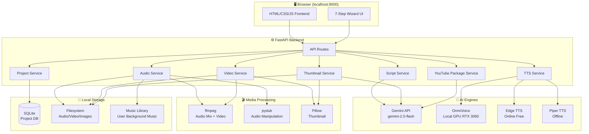
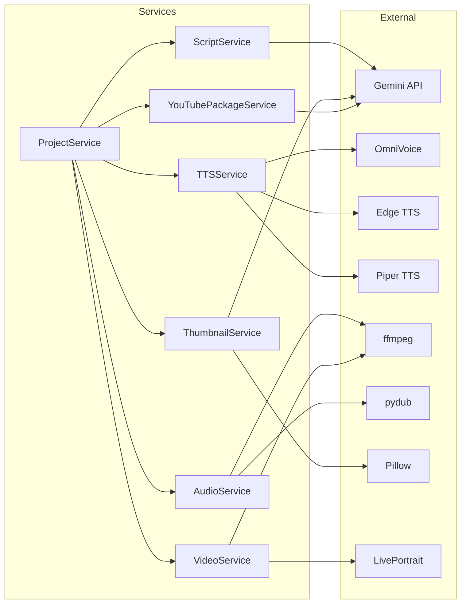

# ARCHITECTURE.md — Daily Intel English Studio

<!-- crystallize_version: 0.8.0 -->

## System Overview

Daily Intel English Studio là một **local web application** chạy trên `http://localhost:8000`. Backend Python FastAPI xử lý toàn bộ logic AI, TTS, audio/video processing. Frontend HTML/CSS/JS thuần túy giao tiếp với backend qua REST API.

```
Browser (localhost:8000)
        ↕ REST API / WebSocket (streaming)
FastAPI Backend (Python 3.11+)
        ├── Gemini API (script + learning content + thumbnail fill)
        ├── OmniVoice (local GPU TTS — RTX 3060 12GB)
        ├── Edge TTS (backup TTS — free, online)
        ├── Piper TTS (offline fallback TTS)
        ├── pydub + ffmpeg (audio mix + video export)
        ├── Pillow (thumbnail generation)
        └── SQLite (project storage)
```

## ViePilot Organization Context

profile_id: none / not configured

---

## Diagram Applicability Matrix

| Diagram Type | Status | Rationale |
|---|---|---|
| system-overview | required | Kiến trúc local web app multi-module |
| data-flow | required | Pipeline 7 bước Script→Audio→Video |
| event-flows | optional | WebSocket streaming TTS |
| module-dependencies | required | Services graph |
| deployment | N/A | Local only, no cloud deployment |
| user-use-case | optional | Single user, use cases straightforward |

---

## System Overview Diagram



---

## Data Flow Diagram (7-Step Pipeline)

```mermaid
flowchart LR
    A([▶ New Project]) --> B

    subgraph B["Step 1: Config"]
        B1[Topic\nCEFR Level\nDuration]
        B2[Speakers\nGender\nAccent]
        B3[Language Features\nCollocation/Idiom/Slang]
    end

    subgraph C["Step 2: AI Script"]
        C1[Gemini API\nStrict Prompt]
        C2[Script Preview\n+ Inline Editor]
        C3[Re-generate\nper segment]
    end

    subgraph D["Step 3: Learning Content"]
        D1[Vocabulary List\ntiered]
        D2[Collocation\n& Idiom explain]
        D3[Grammar Structures\n+ Comprehension Q]
    end

    subgraph E["Step 4: TTS Audio Studio"]
        E1[Voice Assignment\nper speaker]
        E2[OmniVoice GPU\ngenerate per line]
        E3[Preview + Mix\npydub + ffmpeg]
        E4[Export\nMP3 + WAV]
    end

    subgraph F["Step 5: Video Studio"]
        F1[Background\nTemplate / Image]
        F2[Subtitle Overlay\nburned-in + SRT]
        F3[Lips-sync Avatar\nLivePortrait]
        F4[Export MP4]
    end

    subgraph G["Step 6: Thumbnail"]
        G1[Template Select]
        G2[AI Fill\nGemini]
        G3[Manual Editor]
        G4[A/B Export\n16:9 + 9:16]
    end

    subgraph H["Step 7: YouTube Package"]
        H1[AI Description\nGemini]
        H2[Auto Timestamps\nfrom audio]
        H3[Tags & Keywords]
        H4[Full Transcript\n+ Vocab + Grammar]
    end

    B --> C --> D --> E --> F --> G --> H
    H --> I([📦 Export Package\nReady for YouTube])
```



---

## Module Dependencies



---

## Services Definitions

### 1. ScriptService (`app/services/script_service.py`)
- **Responsibility:** Generate podcast script via Gemini API with strict prompt control
- **Inputs:** topic, CEFR level, duration, num_speakers, genre, accent, language_features
- **Outputs:** Structured script JSON (speaker, line, timing_estimate, language_notes)
- **Key logic:** CEFR-calibrated prompt templates, per-genre prompt, language feature toggles
- **Re-generate:** per-segment regeneration support

### 2. TTSService (`app/services/tts_service.py`)
- **Responsibility:** Convert script lines → audio files per speaker
- **Engines (priority order):**
  1. OmniVoice (GPU) — primary, voice design via text description
  2. Edge TTS — backup (free, online, many accents)
  3. Piper TTS — offline fallback
  4. Google Cloud TTS — optional API
  5. Azure TTS — optional API
- **Outputs:** Per-line WAV/MP3 files in `data/tts_cache/`
- **Voice mapping:** Each speaker → engine + voice_id + speed/pitch/volume settings

### 3. AudioService (`app/services/audio_service.py`)
- **Responsibility:** Mix per-speaker audio lines → final podcast audio
- **Operations:** 
  - Concatenate lines in order with silence gaps
  - Add background music from `data/music_library/` (optional, volume ducking)
  - Normalize audio levels
  - Export MP3 (192kbps) + WAV (44100Hz 16bit)
- **Timestamps:** Generate timestamps JSON for YouTube chapters

### 4. VideoService (`app/services/video_service.py`)
- **Responsibility:** Generate podcast video (MP4)
- **Pipeline:**
  - Phase 1 fallback: Background image + audio + subtitle overlay (ffmpeg)
  - Phase 1 primary: LivePortrait lips-sync per speaker avatar
  - SRT file generation from timestamps
- **Output:** MP4 (1280x720 for standard, 720x1280 for Shorts) + SRT file

### 5. ThumbnailService (`app/services/thumbnail_service.py`)
- **Responsibility:** Generate professional YouTube thumbnails
- **Pipeline:** Load template PNG → Gemini fills text/color → Pillow renders → export 3-5 A/B variants
- **Templates:** Stored in `frontend/static/thumbnail_templates/`
- **Output:** PNG 1280x720 + PNG 720x1280 (Shorts)

### 6. YouTubePackageService (`app/services/youtube_service.py`)
- **Responsibility:** Generate complete YouTube upload package
- **Output document contains:**
  - AI-generated video description (Gemini)
  - Chapters with timestamps
  - Tags & keywords (SEO)
  - Full transcript
  - Vocabulary list + explanations
  - Grammar structures
  - Comprehension questions
  - Key takeaways
- **Format:** Markdown + plain text for easy copy-paste

### 7. ProjectService (`app/services/project_service.py`)
- **Responsibility:** CRUD for projects, auto-save, state machine
- **State machine:** `draft → script_generated → audio_generated → video_generated → complete`
- **Storage:** SQLite + JSON sidecar files per project

---

## Technology Decisions

| Decision | Choice | Rationale |
|---|---|---|
| Backend framework | FastAPI | Async, fast, auto OpenAPI docs, Python ecosystem |
| Frontend | Vanilla HTML/CSS/JS | Nhẹ, không dependency, dễ maintain |
| Primary TTS | OmniVoice (k2-fsa) | 600+ langs, voice design, RTF 0.025 trên RTX 3060 |
| Backup TTS | Edge TTS | Free, online, 300+ voices including all English accents |
| Audio processing | pydub + ffmpeg | Mature, well-documented, wide format support |
| Video generation | ffmpeg | Universal, GPU-accelerated |
| Lips-sync | LivePortrait | Fastest inference, real-time capable, VRAM-efficient |
| Thumbnail | Pillow + template | Consistent branding, no API cost, user-editable |
| AI engine | Gemini 2.0 Flash | Fast, cost-effective, high quality, existing API key |
| Database | SQLite | Zero-config, single-user, sufficient performance |
| Storage | Local filesystem | Simple, offline-first, no cloud dependency |

---

## API Endpoints

### Projects
```
GET    /api/projects              # List all projects
POST   /api/projects              # Create new project
GET    /api/projects/{id}         # Get project details
PUT    /api/projects/{id}         # Update project
DELETE /api/projects/{id}         # Delete project
```

### Script Generation
```
POST   /api/projects/{id}/script/generate    # Generate script via Gemini
POST   /api/projects/{id}/script/regenerate  # Regenerate specific segment
PUT    /api/projects/{id}/script             # Save edited script
```

### Learning Content
```
POST   /api/projects/{id}/learning/generate  # Generate vocabulary/grammar content
GET    /api/projects/{id}/learning           # Get learning content
```

### TTS & Audio
```
POST   /api/projects/{id}/tts/preview        # Preview single line TTS
POST   /api/projects/{id}/audio/generate     # Generate full audio mix
GET    /api/projects/{id}/audio/status       # Check generation status (SSE)
GET    /api/projects/{id}/audio/download     # Download final audio
```

### Video
```
POST   /api/projects/{id}/video/generate     # Generate video
GET    /api/projects/{id}/video/status       # Check status (SSE)
GET    /api/projects/{id}/video/download     # Download video
```

### Thumbnails
```
POST   /api/projects/{id}/thumbnails/generate  # Generate A/B thumbnails
GET    /api/projects/{id}/thumbnails           # List thumbnails
GET    /api/thumbnails/templates               # List templates
```

### YouTube Package
```
POST   /api/projects/{id}/youtube/generate   # Generate YouTube package
GET    /api/projects/{id}/youtube            # Get package content
```

### TTS Engines
```
GET    /api/tts/engines           # List available engines + status
GET    /api/tts/voices/{engine}   # List voices for engine
POST   /api/tts/test              # Test voice
```

### Music Library
```
GET    /api/music                 # List music library
DELETE /api/music/{filename}      # Remove track
```

---

## Data Models

### Project
```json
{
  "id": "uuid",
  "name": "My Podcast Episode",
  "status": "draft|script_generated|audio_generated|video_generated|complete",
  "config": {
    "topic": "string",
    "cefr_level": "A1|A2|B1|B2|C1|C2",
    "duration_minutes": 10,
    "num_speakers": 2,
    "genre": "debate|instructions|interview|...",
    "accent": "american|british|australian|...",
    "language_features": {
      "collocation": true,
      "idiom": true,
      "slang": false,
      "local_expressions": false,
      "phrasal_verbs": true,
      "business_register": false
    }
  },
  "speakers": [
    {
      "id": "speaker_1",
      "name": "Alex",
      "gender": "male",
      "accent": "american",
      "tts_engine": "omnivoice",
      "voice_description": "Young male, American accent, friendly tone",
      "speed": 1.0,
      "pitch": 0,
      "volume": 1.0
    }
  ],
  "script": [...],
  "learning_content": {...},
  "audio_path": "data/audio/uuid/final.mp3",
  "video_path": "data/video/uuid/final.mp4",
  "thumbnails": [...],
  "youtube_package": {...},
  "created_at": "ISO8601",
  "updated_at": "ISO8601"
}
```

### Script Line
```json
{
  "id": "line_001",
  "speaker_id": "speaker_1",
  "text": "Hello! Welcome to Daily Intel English.",
  "language_notes": {
    "collocations": ["Welcome to"],
    "idioms": [],
    "grammar_point": "Present Simple — greeting"
  },
  "audio_path": "data/tts_cache/uuid/line_001.wav",
  "duration_seconds": 2.3
}
```
