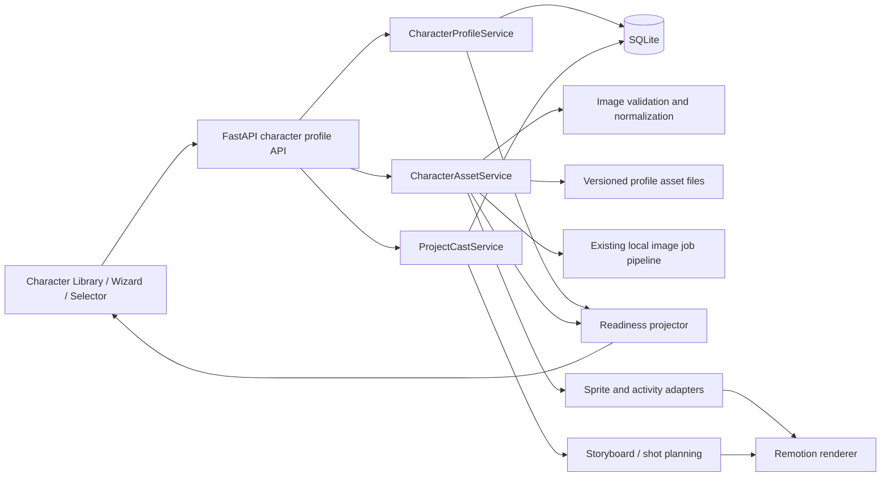

# Phase 33 — Character Profiles v2

**Status:** Proposed / unopened  
**Entry gate:** Phase 32 Gate B-22 accepted by the owner  
**Exit gate:** Gate B-23, owner acceptance of the library, creation wizard, selector, and one real three-character project  
**Source:** `docs/brainstorm/session-2026-10-10.md`  
**UI baseline:** `.viepilot/ui-direction/session-2026-10-06/index.html` and the current `/characters` application shell

## 1. Objective

Turn the existing visual-only character records into reusable character profiles. A profile owns identity, role and personality, appearance, voice defaults, visual assets, sprite readiness, and activity coverage. The user can create any number of profiles through a guided wizard and explicitly assign a profile to each project speaker from a game-style selector.

The normal workflow must stay inside the application. The user can generate pictures with the existing local image pipeline or upload pictures made elsewhere. Uploading into a named slot assigns the canonical asset key; the system does not infer or invent the name.

## 2. Locked scope

### Included

- Unlimited active and archived character profiles; projects retain the current limit of six speakers.
- A ten-step creation wizard with autosave, resume, fixed progress, and a large live character preview.
- Identity, role, personality, speaking style, appearance, one default outfit, and reusable voice defaults.
- Direct single-slot upload and bulk upload mapping for core pictures and sprite assets.
- Local generation and provider-neutral prompt export for pictures made outside the application.
- Independent readiness badges for profile, voice, core visuals, talking starter, full expressions, full sprite pack, and activities.
- Explicit profile assignment by stable character ID. Voice defaults are copied into the project and remain independently editable.
- Migration of Lina and Alex in place without changing their IDs, files, cast assignments, or old project voice settings.
- Safe archive and dependency-aware permanent deletion.
- Dynamic Sprite and Activity Library support for every profile.
- Three to six speaker projects while each storyboard beat continues to show at most two characters.

### Deferred

- Three or more visible characters in one frame.
- Multiple outfits within one profile.
- Cloud image-analysis or automatic asset naming.
- Automatic approval of generated or uploaded pictures.
- Replacing project-specific speaker settings with live profile references.

## 3. Product rules

1. Stable IDs are authoritative. Display names are only labels and search input.
2. Active names are unique after trim and case normalization. Archived names do not reserve a name.
3. Selecting a roster card previews a profile. Only **Choose for {speaker}** changes the project.
4. The same profile cannot be assigned to two speakers in one project.
5. Assigning a profile copies its voice defaults into the speaker. Later profile edits never overwrite project settings automatically.
6. A profile with approved core visuals and valid voice defaults is video-ready for still scenes.
7. Seven approved Tier 1 sprites unlock **Talking ready — Starter**. Tier 2 and Tier 3 are optional upgrades.
8. Activity pictures improve coverage and never block video readiness.
9. Local AI output and uploads that pass technical checks still enter `needs_review`.
10. Replacing an identity base increments `identity_version` and marks dependent current assets `stale`; old versioned files remain available to project casts that already reference them.
11. Archive is the normal removal action. Permanent deletion is allowed only when no project, shot, sprite, or activity dependency remains.
12. Lina and Alex are protected seed profiles: they can be used and duplicated, but not permanently deleted.

## 4. User experience

### 4.1 Character Library

Reuse the current library grid and detail-panel pattern. Add search, active/archived filter, readiness filters, **Create profile**, **Duplicate**, **Archive**, and **Resume setup**. The selected card opens a large profile panel with portrait/full body, description, personality, voice preview, outfit, readiness badges, activity counts, and actionable missing requirements.

The layout must avoid the small nested dialog that caused errors in the Activity Library workflow:

- At desktop widths, use the available page height and a two-panel layout with one page scroll.
- Keep the selected picture or character preview large enough to compare identity and alignment.
- Use at least 16 px body text and full labels for asset type and state.
- At narrow widths, stack the panels and keep the primary action sticky at the bottom.
- Never place the complete ten-step form in one scrolling card.

### 4.2 Character Creation Wizard

| Step | Purpose | Completion rule |
|---|---|---|
| 0 | Start method | Blank profile, duplicate, or continue draft selected |
| 1 | Identity | Unique display name, role, and introduction saved |
| 2 | Personality | Traits, speaking style, and dialogue behavior saved |
| 3 | Appearance | Physical description and one default outfit saved |
| 4 | Voice | Engine, voice, accent, speed, pitch, volume validated; sample available |
| 5 | Identity reference | Approved reference portrait establishes identity version 1 |
| 6 | Core visuals | Full body, calm, smile, and surprised portraits approved |
| 7 | Talking starter | Seven Tier 1 sprite slots approved |
| 8 | Expressions | Eight Tier 2 slots; optional and resumable |
| 9 | Gestures | Fourteen Tier 3 slots; optional and resumable |
| 10 | Activities and finish | Coverage summary, missing items, and finish action |

Every step autosaves explicit fields through a bounded PATCH request. The wizard stores the last completed step but computes readiness from saved data and approved assets. Refreshing or closing the browser must not lose completed work.

### 4.3 Visual Asset Studio

Each slot shows an example, requirements, prompt, current asset, validation result, and the actions **Generate locally**, **Add image**, **Replace**, **Remove**, and **Approve**.

Direct upload behavior:

- The route contains the slot key, so a file uploaded to `smile__open` receives that exact key.
- The original filename remains metadata only.
- The server validates actual image bytes, format, size, dimensions, transparency where required, and canvas-edge contact.
- The browser shows a local preview immediately and the persisted server result after upload.
- A failed upload leaves the previous approved asset intact.

Bulk upload behavior:

- Show all selected images and a required slot dropdown for each.
- Filename matching can suggest a slot but cannot complete the import without review.
- Unmapped files, duplicate mappings, and replacement choices are visible before submission.
- Import is all-or-explicit: each file reports success or failure; no file is silently discarded.

### 4.4 Character Selector

The selector is shared by project setup and Step 5:

- Top: up to six speaker slots.
- Left: searchable/filterable profile roster.
- Right: large selected-profile panel with portrait/full body, role, personality, voice sample, outfit, renderer compatibility, and readiness explanations.
- **Choose for {speaker}** shows a small change summary when the speaker already contains custom name or voice settings.
- Assigned profiles remain visible but disabled for other slots, with the owning speaker named.
- Project cast stores the chosen `character_id` and `profile_version`; no cast is inferred from a matching name.

## 5. Architecture

### Boundaries

- `CharacterProfileService` owns profile fields, normalized names, autosave, archive, dependency reports, duplication, and computed readiness.
- `CharacterAssetService` owns slot contracts, versioned files, validation, review state, upload mapping, prompt packs, and compatibility manifests.
- `ProjectCastService` owns explicit assignment, uniqueness within a project, profile-version pinning, and copy-on-assign defaults.
- Existing sprite and activity services consume dynamic profile IDs through adapters. Their rendering contracts remain stable.
- `sprite_set.json` can remain a derived compatibility manifest; database rows and versioned files are the source of truth.

## 6. Data design

Implement migration `018_character_profiles_v2.sql`. Extend the existing `characters`, `character_assets`, and `project_cast` tables instead of introducing a second identity table.

### `characters` additions

- `normalized_name`, unique among rows where `archived_at IS NULL`.
- `intro`, `personality_json`, `speaking_style`, `dialogue_behavior`.
- Voice defaults: `default_accent`, `default_tts_engine`, `default_voice_id`, `default_voice_description`, `default_speed`, `default_pitch`, `default_volume`.
- `identity_version INTEGER NOT NULL DEFAULT 1`.
- `wizard_step INTEGER NOT NULL DEFAULT 0`.
- `archived_at` and `is_seed INTEGER NOT NULL DEFAULT 0`.

The existing visual `status` remains for backward compatibility during the phase. API clients consume computed readiness instead of interpreting it as the complete profile lifecycle.

### `character_assets` additions

- `slot_key`, `source`, `original_filename`, `review_state`, `validation_json`.
- `identity_version`, `is_current`, `updated_at`.
- A current-slot index supports one current asset per character, identity version, and slot.

Existing candidate/sheet rows are backfilled without moving files in the migration. Existing Lina/Alex sprite files are registered as version 1 assets in a resumable post-migration command that can be rehearsed on a database and data-directory copy.

### `project_cast` additions

- `profile_version INTEGER NOT NULL DEFAULT 1`.
- Unique `(project_id, character_id)` prevents duplicate profile assignment.

Existing rows backfill the current character identity version. Old speaker rows retain their current voice values.

The proposed SQL contract lives in `.viepilot/schemas/phase33-character-profiles.sql`; the implementation migration remains the final authority after Task 33.1.

## 7. API contract

The detailed proposed contract is in `.viepilot/schemas/phase33-character-profiles-api.yaml`.

Core routes:

- `GET /api/visuals/characters?state=&readiness=&q=`
- `POST /api/visuals/characters`
- `GET /api/visuals/characters/{id}`
- `PATCH /api/visuals/characters/{id}`
- `POST /api/visuals/characters/{id}/duplicate`
- `POST /api/visuals/characters/{id}/archive`
- `POST /api/visuals/characters/{id}/restore`
- `GET /api/visuals/characters/{id}/dependencies`
- `DELETE /api/visuals/characters/{id}`
- `GET /api/visuals/characters/{id}/asset-slots`
- `POST /api/visuals/characters/{id}/assets/{slot_key}/upload`
- `POST /api/visuals/characters/{id}/assets/upload-batch`
- `POST /api/visuals/characters/{id}/assets/{slot_key}/generate`
- `PUT /api/visuals/characters/{id}/assets/{asset_id}/review`
- `DELETE /api/visuals/characters/{id}/assets/{asset_id}`
- `GET /api/visuals/characters/{id}/prompt-pack`
- `PUT /api/visuals/projects/{project_id}/cast`

All mutation errors return a stable `code`, a user-facing `message`, and optional `field` or `slot_key`. Upload endpoints use `multipart/form-data`; batch mapping is a JSON form field paired with files.

## 8. File and transaction safety

- Read uploads in bounded chunks through `UploadFile`; do not buffer unbounded request bodies.
- Validate image bytes with Pillow, call `verify()`, reopen for decode, enforce configured pixel limits, and reject decompression-bomb errors.
- Stage normalized files under a temporary profile directory, then use an atomic same-volume rename.
- Keep SQLite write transactions short. Perform image decoding and normalization before opening the write transaction.
- If the database write fails after a file move, remove the new unreferenced file and retain the prior current asset.
- Store files under immutable ID/version paths, for example `data/library/characters/{character_id}/v{identity_version}/{slot_key}.png`.
- Never build filesystem paths from display names or original filenames.

## 9. Delivery plan

| Task | Outcome | Depends on |
|---|---|---|
| 33.1 | Migration, domain fields, versioning, and Lina/Alex rehearsal | Gate B-22 |
| 33.2 | Profile/readiness/lifecycle service and API | 33.1 |
| 33.3 | Slot contract, direct upload, review, validation, prompt pack | 33.1, 33.2 |
| 33.4 | Library and ten-step wizard with autosave/resume | 33.2 |
| 33.5 | Asset Studio, bulk mapping, and local generation integration | 33.3, 33.4 |
| 33.6 | Tiered sprite pack and renderer compatibility | 33.3, 33.5 |
| 33.7 | Game-style selector and copy-on-assign cast flow | 33.2, 33.4 |
| 33.8 | Dynamic Activity/Storyboard/Shot integration for 3–6 cast | 33.6, 33.7 |
| 33.9 | Migration rehearsal, regression, real three-character render, Gate B-23 | 33.1–33.8 |

The executable task cards are in `.viepilot/phases/33-character-profiles-v2/tasks/`.

## 10. Verification strategy

### Automated

- Migration on a temporary database and on a copy of the current real database.
- Service/API tests for normalized names, archive/delete dependencies, autosave, readiness, identity versioning, upload rollback, review, and duplicate-cast prevention.
- Image-validation tests use small generated fixtures for actual format, dimensions, alpha, corruption, oversized pixels, and replacement rollback.
- Browser tests cover wizard refresh/resume, one-slot upload, five-file mapping, visible errors, selector preview versus choose, and keyboard access.
- Existing character, sprite, activity, storyboard, shot, and Remotion suites remain green.

### Real acceptance

1. Copy the real database and character asset folders.
2. Apply migration and register Lina/Alex without changing IDs or existing cast rows.
3. Create a third profile through the wizard.
4. Upload an external identity picture, core visuals, and Tier 1 sprites through the UI.
5. Configure and preview the default voice.
6. Assign Lina, Alex, and the new profile to a three-speaker project.
7. Confirm storyboard pairing follows the active speakers and never shows more than two people in a beat.
8. Render a still-scene video and a Talking Starter video.
9. Re-render an old Lina/Alex project and compare cast, voice configuration, and sprite selection.
10. The owner accepts the library, wizard, selector, and videos at Gate B-23.

## 11. Exit criteria

- A third reusable profile can be created without copying or renaming files in a system folder.
- The wizard can be interrupted and resumed without data loss.
- Slot uploads receive deterministic canonical keys and remain pending until approved.
- Tier 1 alone enables Talking Starter; missing optional tiers are explained without blocking still video.
- A project can explicitly assign three distinct profiles while each beat remains limited to two visible characters.
- Profile edits do not overwrite existing project voice settings.
- Replacing identity does not cause old projects to silently use new incompatible assets.
- Lina/Alex and existing projects survive migration and regression tests.
- Archive and deletion cannot orphan dependencies.
- Gate B-23 is accepted before Phase 33 is closed.

## 12. Official research used

Accessed 2026-10-10:

- FastAPI, Request Files: <https://fastapi.tiangolo.com/tutorial/request-files/> — `UploadFile`, multipart, and multiple-file upload behavior.
- MDN, File drag and drop: <https://developer.mozilla.org/en-US/docs/Web/API/HTML_Drag_and_Drop_API/File_drag_and_drop> — use a file input as the accessible click/keyboard path for a drop zone.
- MDN, FormData: <https://developer.mozilla.org/en-US/docs/Web/API/FormData> — multipart submission through `fetch`.
- SQLite, Foreign Key Support: <https://www.sqlite.org/foreignkeys.html> — per-connection enforcement, actions, and child-key indexes.
- SQLite, Transaction: <https://www.sqlite.org/lang_transaction.html> — short write transactions because SQLite has one simultaneous writer.
- Pillow, Image module: <https://pillow.readthedocs.io/en/stable/reference/Image.html> — verification, reopen-before-load, and decompression-bomb protection.

